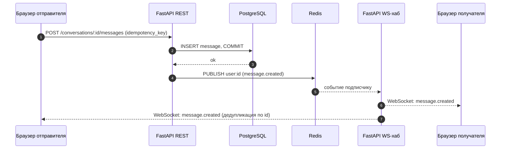
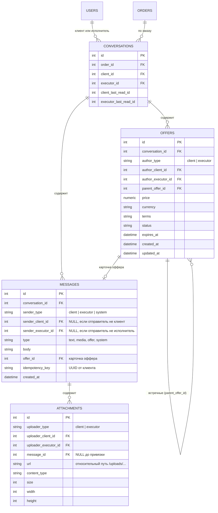
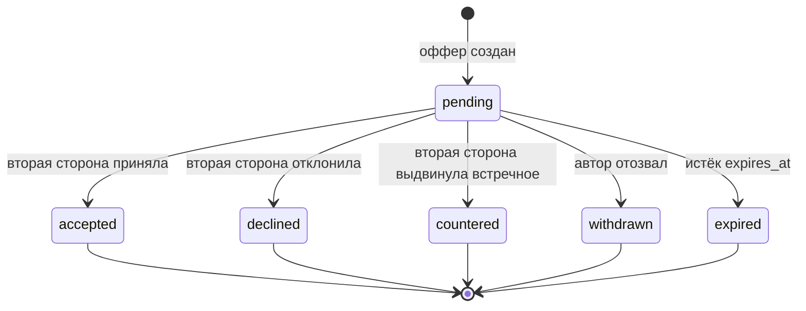

# Чат по заказу: клиент ↔ исполнитель

Документ описывает проектирование чата между клиентом и исполнителем в рамках заказа: сообщения, вложения (медиа) и офферы с торгом. Стек: FastAPI, SQLAlchemy 2.0, PostgreSQL, Redis, Next.js.

BPMN-диаграмма архитектуры: [`BP-05-chat.bpmn`](../diagrams/BP-05-chat.bpmn) (см. раздел 13).

## 1. Цели и границы

**Функциональные требования**

- Чат создаётся по паре «заказ + исполнитель». Участники: клиент и исполнитель.
- Текстовые сообщения и вложения (изображения, видео).
- Оффер: исполнитель предлагает условия (цена, срок), клиент принимает, отклоняет или выдвигает встречное предложение. Торг может продолжаться несколько раундов.
- Доставка в реальном времени, история с пагинацией, счётчик непрочитанных.

**Нефункциональные требования**

- Нагрузка на старте: 100–200 пользователей. Достаточно одного экземпляра FastAPI, одного PostgreSQL и уже развёрнутого Redis.
- Сообщение не теряется: клиент не увидит сообщение, которого нет в базе.
- Повторная отправка (ретрай) не создаёт дубликатов.
- Права проверяются на каждом запросе и на каждом WebSocket-подключении.

**Вне рамок документа:** оплата и эскроу, модерация контента, push- и email-уведомления.

## 2. Архитектура

```
Браузер ──REST──► FastAPI ──► Postgres (источник истины)
   ▲                  │
   └──── WS ◄─── Redis pub/sub (канал user:{id}) ◄─ publish после commit
Файлы: браузер ──POST (multipart)──► FastAPI ──► локальный диск (uploads/), отдача по /uploads/...
```

Принципы:

1. **PostgreSQL — единственный источник истины.** WebSocket только доставляет события.
2. **Все изменения идут через REST** (сообщения, офферы, вложения). У них есть валидация, права, идемпотентность и ретраи, как у обычного API.
3. **Одно WebSocket-соединение на пользователя**, а не на чат. По нему приходят события всех его бесед.
4. **Событие публикуется в Redis строго после commit.** Redis Pub/Sub не гарантирует доставку, поэтому после переподключения клиент догружает пропущенное через REST (`after_id`).
5. **Файлы хранятся локально и проходят через FastAPI.** Браузер отправляет их в REST (multipart), бэкенд сохраняет на диск и отдаёт по `/uploads/...`; через WebSocket файлы не передаются (сейчас), позже хранилище можно вынести за интерфейс «storage».

### Поток отправки сообщения



## 3. Модель данных



Ограничения и индексы:

| Таблица | Ограничение / индекс | Зачем |
|---|---|---|
| `conversations` | `UNIQUE (order_id, executor_id)` | одна беседа на пару «заказ + исполнитель» |
| `messages` | индекс `(conversation_id, id)` | курсорная пагинация «50 сообщений старше id=X» |
| `messages` | частичный `UNIQUE (conversation_id, idempotency_key)` | идемпотентность при ретраях (ключ не NULL) |
| `offers` | частичный `UNIQUE (conversation_id) WHERE status = 'pending'` | в беседе не больше одного активного оффера |

«Прочитано» хранится как `last_read_id` на участника беседы, а не флагом на каждом сообщении. Непрочитанные = сообщения с `id > last_read_id` от второй стороны.

## 4. Офферы

### Жизненный цикл



Встречное предложение создаёт **новый** оффер с `parent_offer_id`, а предыдущий переводится в `countered`. Так в базе сохраняется вся цепочка торга.

### Правила

- Оффер в ленте — это `Message(type = 'offer', offer_id = ...)`. Карточка отрисовывается по актуальному статусу оффера.
- Принять, отклонить или ответить встречным может только **вторая сторона** (не автор оффера).
- Автор может отозвать свой `pending`-оффер.
- Принятие выполняется в одной транзакции: `SELECT ... FOR UPDATE` по офферу, проверки (статус `pending`, срок не истёк, права), затем `status = 'accepted'`, закрепление заказа за исполнителем с согласованной ценой и system-сообщение.
- События `offer.updated` и `message.created` публикуются после commit.
- Что происходит с `pending`-офферами при отмене заказа (переводятся в `withdrawn` или `expired`) и можно ли писать в чат после завершения заказа, нужно решить на уровне бизнес-правил.

## 5. Вложения и файловое хранилище

**Решение на текущем этапе: медиа хранится на локальном диске, без объектного
хранилища.** Файлы складываются в каталог `uploads/` рядом с бэкендом и отдаются
уже настроенным маунтом `app.mount("/uploads", StaticFiles(...))` в `main.py`.

### Схема загрузки

1. `POST /attachments` — multipart-загрузка файла (`file`). Бэкенд проверяет тип
   и размер по белому списку, сохраняет файл в локальное хранилище
   (`uploads/chat/...`) и создаёт `Attachment` (без `message_id`), возвращая
   `id` и `url`.
2. `POST /conversations/:id/messages` с `{type: "media", attachment_ids: [...], idempotency_key}`.
   Бэкенд проверяет, что вложения принадлежат отправителю и ещё ни к чему не
   привязаны, и привязывает их к сообщению.

### Локальное хранилище

- Файлы лежат в каталоге `uploads/`, путь задаётся настройкой; в БД хранится
  относительный URL — `Attachment.url` (например `/uploads/chat/<uuid>.<ext>`).
- Отдача статики — существующим маунтом `/uploads`. В проде этот путь
  проксирует nginx (кэширование, лимиты, `X-Accel-Redirect` при необходимости).
- Каталог `uploads/` не должен быть доступен напрямую в обход приложения.

Дополнительно:

- Реальный тип файла проверять по сигнатуре (magic bytes), а не доверять
  `content_type` от клиента.
- Для изображений делать превью и сохранять `width`/`height`, чтобы лента не «прыгала».
- Лимиты: максимальный размер файла, число вложений на сообщение и на пользователя.
- Раз в сутки удалять вложения, которые загружены, но не привязаны к сообщению
  дольше суток.

### Ограничения и путь к объектному хранилищу

Локальный диск удобен на старте, но привязывает файлы к одному инстансу и
усложняет бэкапы и горизонтальное масштабирование. Поэтому доступ к файлам
стоит изолировать за интерфейсом «storage» (сохранение/удаление/get-url), чтобы
будущий переезд на S3-совместимое хранилище (Garage/SeaweedFS) свёлся к смене
реализации и переносу файлов (`rclone`), без изменения модели данных и API.

Что учесть при переезде (когда он понадобится):

- Код работает через S3 API (`aioboto3` или `boto3`); endpoint, ключи и имя
  бакета берутся из переменных окружения.
- Бакет приватный; ссылки на заказы не должны быть публичными без подписи.
- Хранилище — второй источник данных: бэкапы нужны и для PostgreSQL, и для файлов.

## 6. REST API

| Метод и путь | Назначение |
|---|---|
| `GET /conversations` | список бесед с `unread_count` и последним сообщением |
| `GET /conversations/:id/messages?before_id=&after_id=&limit=` | история (курсорная пагинация) и догрузка после реконнекта |
| `POST /conversations/:id/messages` | текст или медиа, `idempotency_key` для идемпотентности |
| `POST /conversations/:id/read` | `{last_read_id}` |
| `POST /conversations/:id/offers` | создать оффер или встречный (`parent_offer_id`) |
| `POST /offers/:id/accept` | принять |
| `POST /offers/:id/decline` | отклонить |
| `POST /offers/:id/withdraw` | отозвать (только автор) |
| `POST /attachments` | multipart-загрузка файла, вернуть `id` и `url` |
| `GET /attachments/:id/url` | получить URL вложения (для просмотра/скачивания) |

## 7. WebSocket и Redis

**Подключение:** `GET /ws`. Браузерный `WebSocket` не умеет ставить заголовки, поэтому:

- если API на том же домене, используется httpOnly-cookie;
- иначе короткоживущий одноразовый ticket в query (`/ws?ticket=...`), который выдаёт `POST /ws/ticket`.

**События сервер → клиент** (конверт `{type, data}`):

| `type` | Когда |
|---|---|
| `message.created` | новое сообщение (текст, медиа, карточка оффера, system) |
| `offer.updated` | изменился статус оффера |

От клиента сервер принимает только `ping`. Всё остальное идёт через REST.

**Redis:**

- Канал на пользователя: `user:{id}`. Бэкенд после commit публикует событие в каналы обоих участников беседы.
- Каждый воркер FastAPI подписан на каналы тех пользователей, чьи сокеты у него открыты, и рассылает полученное локальным сокетам.
- Гарантий доставки нет. Источник истины — PostgreSQL, пропущенное догружается через `after_id`.
- Typing-индикаторы и онлайн-статус (если понадобятся) хранить в Redis с TTL, а не в PostgreSQL.

**Heartbeat:** клиент шлёт `ping` примерно раз в 25 секунд. На nginx выставить `proxy_read_timeout` больше этого интервала и включить апгрейд соединения (`Upgrade`/`Connection`).

## 8. Frontend (Next.js)

- Один провайдер (`'use client'`) держит единственное WebSocket-соединение на всё приложение.
- События пишутся в кэш TanStack Query (`setQueryData`): список бесед, сообщения открытой беседы, карточки офферов обновляются сами.
- Переподключение с экспоненциальной задержкой. После каждого (ре)коннекта инвалидируются кэши `conversations` и `messages`, чтобы подтянуть пропущенное.
- Дедупликация сообщений по `id`. Отправитель тоже получает своё сообщение по WebSocket.
- Отправка сообщений, действия с офферами и загрузка файлов — обычные мутации. Для прогресса загрузки использовать `XMLHttpRequest` или axios.
- Кнопки в карточке оффера зависят от статуса и роли: автору доступно «Отозвать», второй стороне «Принять», «Отклонить», «Встречное предложение», для не-`pending` статусов кнопок нет.

## 9. Права и безопасность

| Действие | Клиент беседы | Исполнитель беседы | Посторонний |
|---|---|---|---|
| Читать сообщения и вложения | да | да | нет |
| Писать сообщения | да | да | нет |
| Создать оффер | встречный | первый и встречный | нет |
| Принять / отклонить оффер | только чужой | только чужой | нет |
| Отозвать оффер | только свой | только свой | нет |

Дополнительно:

- Проверка участия в беседе на каждый REST-запрос и на каждое действие, а не только при входе в приложение.
- Лимиты: максимальная длина сообщения, размер и количество вложений, rate limit на пользователя.
- Белый список типов файлов, проверка сигнатуры, подписанные ссылки с коротким TTL.
- Идемпотентность через `idempotency_key`, блокировка `FOR UPDATE` для операций над оффером.

## 10. Нефункциональные требования для 100–200 пользователей

- Один процесс FastAPI справится с WebSocket-нагрузкой такого размера. Redis Pub/Sub заложен сразу, потому что Redis уже развёрнут и позволяет без переделки добавить воркеры или поды.
- Индекс `(conversation_id, id)` и курсорная пагинация убирают необходимость в `OFFSET`.
- Метрики для мониторинга: число активных WebSocket-подключений, задержка публикации и доставки события, ошибки сохранения сообщения, размер хранилища.
- Бэкапы PostgreSQL и каталога `uploads/` (volume), регулярная проверка восстановления.

## 11. План реализации

1. Модели и миграции Alembic: `conversations`, `messages`, `offers`, `attachments`.
2. REST для бесед и сообщений (текст), курсорная пагинация, `idempotency_key`.
3. WebSocket-хаб + Redis Pub/Sub, события `message.created`.
4. Фронтенд: провайдер WebSocket, список бесед, лента, отправка, реконнект и догрузка.
5. Офферы: API, статусная машина, события `offer.updated`, карточки в ленте.
6. Вложения: локальное хранение (`uploads/`), multipart-загрузка, превью, чистка сирот.
7. Счётчики непрочитанных, лимиты, мониторинг, нагрузочный прогон на 200 соединений.

## 12. Открытые вопросы

- Может ли на один заказ откликаться несколько исполнителей (по беседе на каждого) или исполнитель один?
- Нужна ли оплата через платформу и как она связана с принятым оффером?
- Что происходит с чатом и `pending`-офферами при отмене и при завершении заказа?
- Максимальные размеры и форматы медиа (особенно видео), нужна ли транскодировка?
- Нужны ли уведомления вне сайта (email, push) о новых сообщениях и офферах?
- Когда переходим с локального диска на объектное хранилище (см. раздел 5)?

## 13. Диаграммы (BPMN)

Файл [`BP-05-chat.bpmn`](../diagrams/BP-05-chat.bpmn) описывает схему из раздела 2 в виде BPMN 2.0: каждый участник — отдельный пул, обмен между ними — message flow.

| Пул | Роль |
|---|---|
| Браузер отправителя (Next.js) | отправка сообщения и вложения (multipart) |
| FastAPI: REST API | валидация, сохранение, публикация события |
| PostgreSQL | запись вложения и сообщения, подтверждение commit |
| Redis Pub/Sub | рассылка события подписчикам канала |
| FastAPI: WebSocket-хаб | доставка события по WebSocket |
| Браузер получателя (Next.js) | получение события, обновление интерфейса |
| Локальное хранилище (диск, uploads/) | сохранение файла и отдача по /uploads |